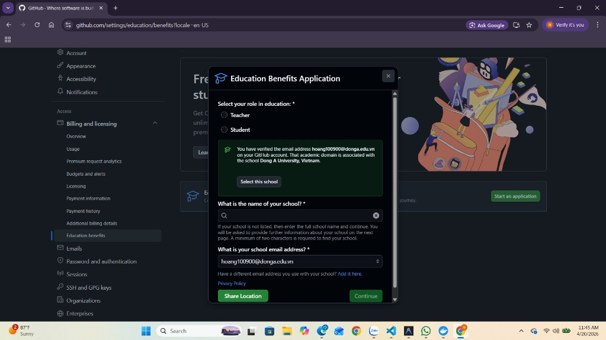
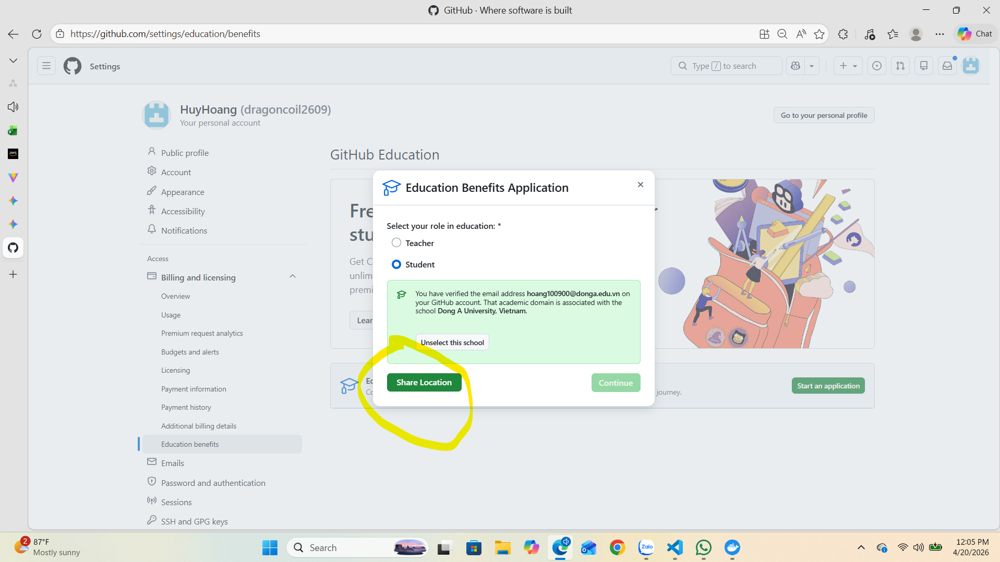
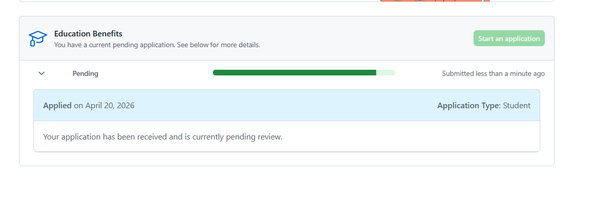

## Bước 1: đăng ký GitHub Student Developer Pack
# Lưu ý bật mã MFA trước mới có thể đăng kí

1. Select your role in education: Bạn tích chọn vào ô Student.
2. Điền mail và chọn select tên trường 
3. chọn xong ấn vào nút Share Location để GitHub xác thực bạn đang ở gần vị trí của trường học.

## Bước 2: Tải lên minh chứng

1. Chụp ảnh thẻ sinh viên: Đặt thẻ sinh viên của bạn lên một mặt phẳng, đảm bảo đủ ánh sáng và thấy rõ: Tên, Ảnh, và quan trọng nhất là Ngày hết hạn hoặc Khóa học.

2. Upload: Tải ảnh lên hệ thống.

3. Lưu ý: Nếu thẻ sinh viên không có ngày hết hạn rõ ràng, bạn có thể bổ sung ảnh chụp bảng điểm hoặc giấy xác nhận sinh viên có mộc đỏ của nhà trường.

4. chờ xét duyệt (thời gian phê duyệt giao động vài tiếng - vài ngày sau khi duyệt chờ tương tự để được cấp ưu đãi)

## Bước 4: Lấy Domain miễn phí (Sau khi đã được duyệt)
1. Khi đã có gói Student, bạn quay lại trang education.github.com/pack:

2. Tìm logo của Name.com hoặc Namecheap.

3. Nhấn "Get access by connecting your GitHub account".

4. Hệ thống sẽ tự động trừ tiền về $0 khi bạn thanh toán domain (thường là đuôi .me, .tech hoặc .rocks).